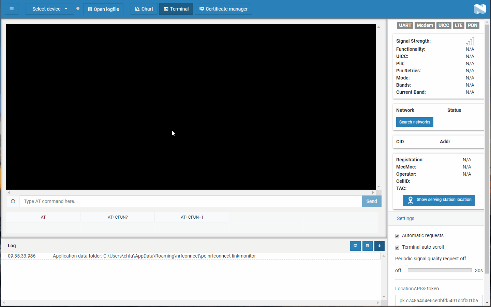

# nRF Connect LTE Link Monitor

nRF Connect LTE Link Monitor is a modem client application that monitors the
modem/link status and activity via AT commands.

## Installation

nRF Connect LTE Link Monitor is installed from nRF Connect for Desktop. For
detailed steps, see
[Installing nRF Connect for Desktop apps](https://docs.nordicsemi.com/bundle/nrf-connect-desktop/page/installing_apps.html)
in the nRF Connect from Desktop documentation.

## Documentation

Read the
[nRF Connect LTE Link Monitor](https://docs.nordicsemi.com/bundle/nrf-connect-linkmonitor/page/index.html)
official documentation.

## Development

See the
[app development](https://nordicsemiconductor.github.io/pc-nrfconnect-docs/)
pages for details on how to develop apps for the nRF Connect for Desktop
framework.

## Feedback

Please report issues on the [DevZone](https://devzone.nordicsemi.com) portal.

## Contributing

See the
[information on contributing](https://nordicsemiconductor.github.io/pc-nrfconnect-docs/contributing)
for details.

## License

See the [LICENSE](LICENSE) file for details.
