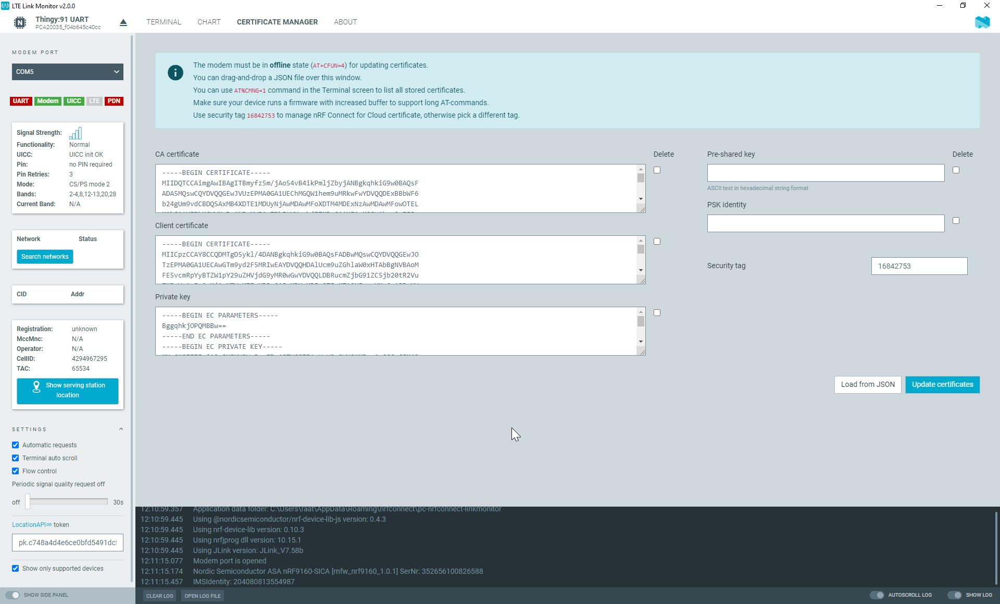

# Managing credentials

You can store and update modem credentials (keys or certificates) manually by sending [Credential storage management %CMNG](https://docs.nordicsemi.com/bundle/ref_at_commands/page/REF/at_commands/security/cmng.html) commands to the modem. The certificate manager simplifies this process by offering a graphical user interface for updating credentials.

Before you can update the credentials stored by the modem, you must put the modem into offline state by sending the AT command ``AT+CFUN=4``.

Each set of keys and certificates stored in the modem is identified by a security tag. This means that all related credentials share the same security tag. Send the command ``AT%CMNG=1`` in the terminal view to display a list of all certificates stored on your device. If you have added your device in nRF Connect for Cloud, you should see a Certificate Authority (CA) certificate, a client certificate, and a private key with security tag 16842753 (which is the security tag for nRF Connect for Cloud credentials).

To manage credentials:

- To add or update credentials, enter a security tag and the new key(s) or certificate(s). Then click **Update certificates**. 
  Instead of entering the credentials manually, you can also import a JSON file. To do so, click **Load from JSON**.
- To delete a key or certificate, select the check-box next to it. Then click **Update certificates**.

    !!! note "Note"
         Deleting the text from the text field does not cause the key or certificate to be unset.*