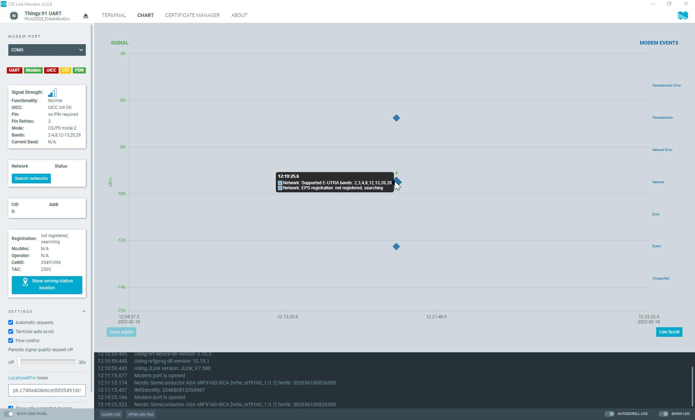

# Viewing modem events

Switch to the chart view to observe modem events and signal quality, either for the connected device or for logged data.

The time-based chart displays signal quality and modem events. The signal quality reported by the modem is the received signal reference power Reference Signal Received Power (RSRP) in Decibel milliwatt (dBm), displayed on the left axis. The modem events are unsolicited result codes and responses to different commands, separated into different categories displayed on the right axis.

To view the information in the chart:

- Hover over the events in the chart to display the list of events under the mouse cursor.
- To navigate the chart, drag it horizontally.
- Zoom in or out using the mouse wheel or the right mouse button.

    !!! note "Note"
         When you zoom or drag, the chart stops displaying the latest incoming events. Click **Live Scroll** under the chart to make sure incoming events are displayed again.