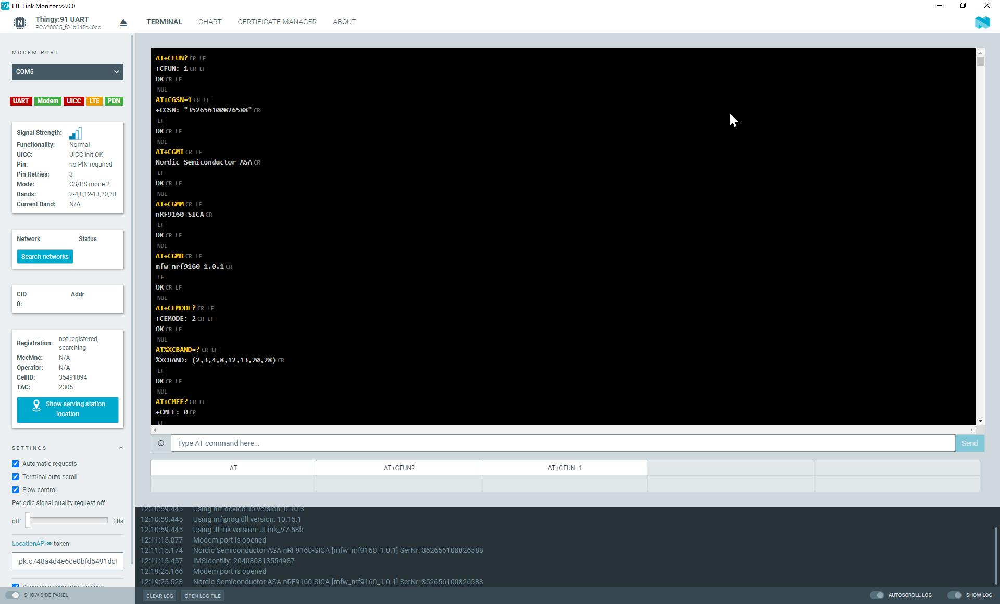

# Viewing and sending AT commands

Switch to the terminal view to observe the AT communication with the modem and to send AT commands.

The terminal displays the AT communication with the modem. Colors are used to differentiate between transmitted commands (yellow), received responses (white), and received unsolicited results (light blue). The abbreviations of control characters are displayed in gray. However, they are not selectable.

You can toggle the terminal's auto-scrolling behavior in the **Settings** section of the side panel.

To interact with the modem:

- Enter text in the command line located directly below the terminal and send it to the modem by pressing Enter or clicking **Send**. 
  The ``CR LF`` line ending is automatically appended to the line.
- Click the macro buttons below the command line to send their stored content to the modem.
- Configure the empty macro buttons with your frequently used commands. 
  To do so, select some text and drag and drop it onto one of the ten buttons.