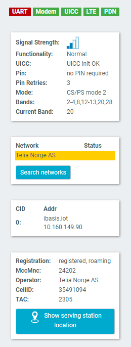
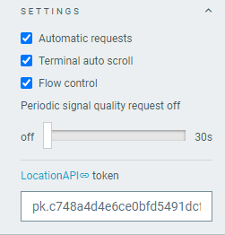
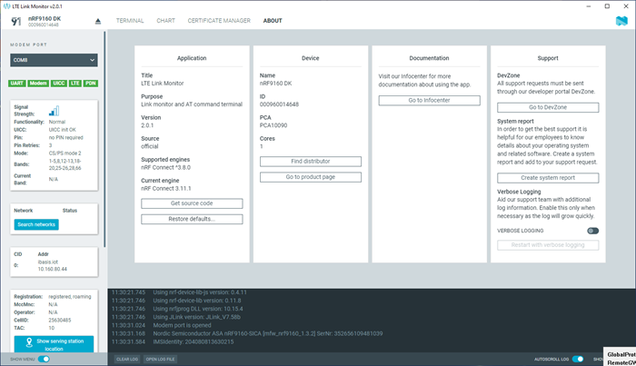

# Overview and user interface

LTE Link Monitor displays information about connected devices and provides details such as signal quality, network information, and AT communication with the modem.

After launching the LTE Link Monitor, the application window is displayed with the following elements:

## Main View

The main view displays the Terminal, Chart, Certificate Manager, or About tab, depending on your selection in the navigation bar.

## Select Device

The **SELECT DEVICE** drop-down menu in the navigation bar lists all supported devices. When you select a device, you can see live information about the current session in the main view. In the chart view, you can alternatively open a log file to load and display the log contents of a previous session.

!!! note "Note"
      You cannot open a log file when a device connection is open.

Select the **Terminal** view to [display and send AT commands](./lm_terminal_view.md), the **Chart** view to [show modem events](./lm_chart_view.md), or the **Certificate manager** to [manage credentials](./lm_manage_credentials.md).

Choose the **About** view to display app information or create a system report.

## Side Panel

The side panel displays information related to the modem, network, and mobile cell.

The first line of indicators helps to visualize the connection state by displaying the indicators in different colors. Hovering over these indicators lists the possible colors and their meanings.

The following sections show information about the modem state, the network, the packet domain group, and the cell.

In the network group, only the connected network is listed automatically. Click **Search networks** to display a complete list of available networks. Be aware that this is a long and blocking operation.

If the connected cell can be resolved by the locationapi.org service, you can click **Show serving station location** to open a small map with the range of the serving station.

## Settings

The **Settings** section of the side panel offers the following options:

- **Automatic requests**: Toggles whether LTE Link Monitor should automatically send a new request after receiving a response from the modem. This is required to gather the information listed in the side panel.

    !!! note "Note"
        Any information displayed in LTE Link Monitor is an interpretation of the responses from the modem. Therefore, turning off automatic requests affects the validity of the information.

- **Terminal auto scroll**: Toggles the terminal's auto-scrolling behavior.

- **Periodic signal quality requests**: Enable this option to send an [Extended signal quality +CESQ](https://docs.nordicsemi.com/bundle/ref_at_commands/page/REF/at_commands/mob_termination_ctrl_status/cesq.html) command at a specified interval. Requires **Automatic requests** to be enabled.

- **LocationAPI token**: Used for accessing the online service. The initial token belongs to a free limited account, so it is recommended to create an account and change the token by following the link in the user interface.

## About

You can view application information, restore defaults, access source code, and documentation. You also can find information on the selected device, access support tools, and enable verbose logging.

## Log

The Log panel allows you to view the most important log events, tagged with a timestamp. Each time you open the app, a new session log file is created. You can find the Log panel and its controls below the main application window.

- When troubleshooting, to view more detailed information than shown in the Log panel, use **Open log file** to open the current log file in a text editor.
- To clear the information currently displayed in the Log panel, use **Clear Log**. The contents of the log file are not affected.
- To hide or display the Log panel in the user interface, use **Show Log**.
- To freeze Log panel scrolling, use **Autoscroll Log**.